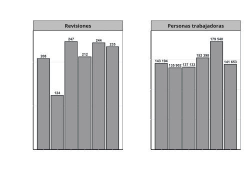
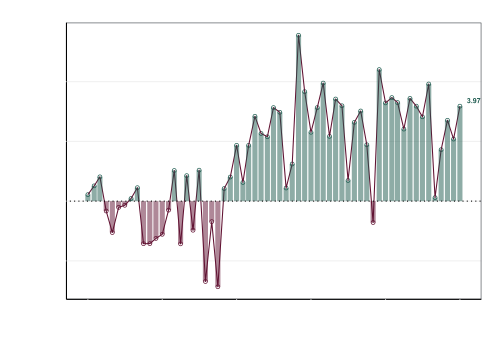
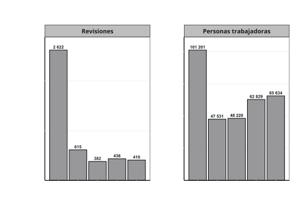
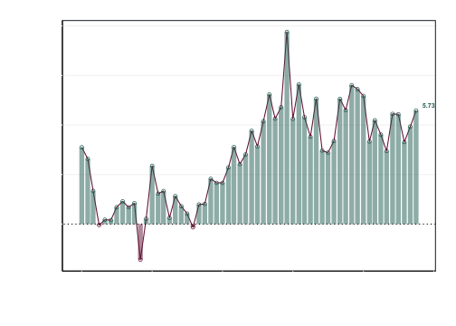
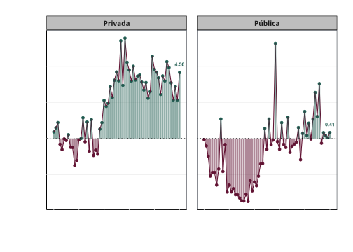
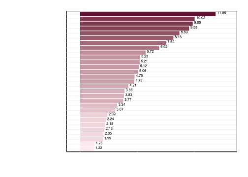
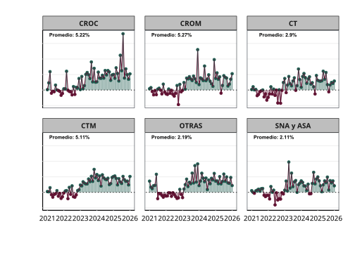

# Revisiones salariales y conflictos colectivos

*Disclaimer: Este repositorio sirve para automatizar el reporte sobre
revisiones salariales y negociaciones colectivas presentado en el
informe mensual del comportamiento de la economía de la Comisión
Nacional de los Salarios Mínimos*

## Jurisdicción Federal

              used (Mb) gc trigger (Mb) max used (Mb)
    Ncells  602845 32.2    1371574 73.3   701680 37.5
    Vcells 1108460  8.5    8388608 64.0  1927043 14.8

En lo que vamos de 2026 se han realizado 235 revisiones salariales en la
jurisdicción federal, que involucraron a 141,653 personas trabajadoras,
quienes lograron incrementos promedio de 7.92% y de 3.97% nominal y
real, respectivamente.

Durante el mes de enero de 2026, se registraron 235 revisiones en la
jurisdicción federal, que involucraron a 141,653 personas trabajadoras.

Estas revisiones tuvieron un incremento promedio nominal de 7.92% y real
de 3.97%.

## Jurisdicción local

En 2025, y hasta el mes de octubre, fecha de los últimos datos
disponibles, se han realizado 8,476 revisiones en la jurisdicción local,
que involucraron a 1,482,311 personas trabajadoras, quienes lograron
incrementos promedio de 9.01% y de 5.00% nominal y real,
respectivamente.

Durante el mes de octubre de 2025, última cifra disponible, se
realizarón 410 revisiones en la jurisdicción local, que involucraron a
65,634 personas trabajadoras.

Estas revisiones tuvieron un incremento promedio nominal de 9.50% y real
de 5.73%.

## Revisiones por tipo de empresa

Durante enero de 2026, de las 235 en la jurisdicción federal, 231 son de
empresas privadas y 4 en publicas. Esto involucró a 121,528 y 20,125
personas trabajadoras, respectivamente. En promedio, las empresas
privadas tuvieron incrementos nóminales de 8.53% y reales de 4.56%. Por
su parte, las empresas públicas tuvieron de 4.22% y 0.41%.

## Revisiones por entidad

Las cinco entidades con los mayores incrementos fueron: Baja California
(11.85%), Tabasco (10.02%), Durango (9.85%), Colima (9.53%) y Sonora
(8.69%).

En cambio, las cinco entidades con los menores incrementos fueron:
Morelos (1.22%), Tamaulipas (1.25%), Chihuahua (1.99%), Hidalgo (2.05%)
y Yucatán (2.13%).

## Revisiones por Central obrera

Las centrales obreras tuvieron variaciones de: CROM (5.3%), CROC (5.2%),
CTM (5.1%), CT (2.9%), OTRAS (2.2%) y SNA y ASA (2.1%).

## Emplazamientos a huelga por entidad
