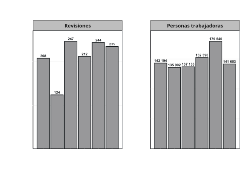
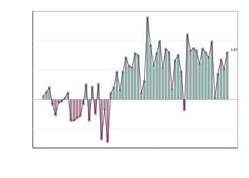
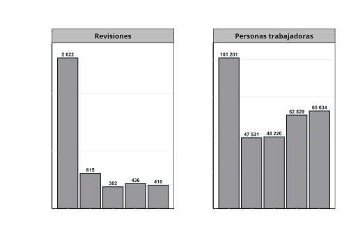
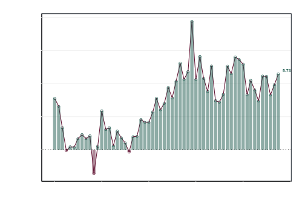
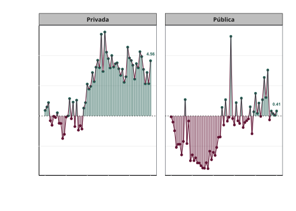
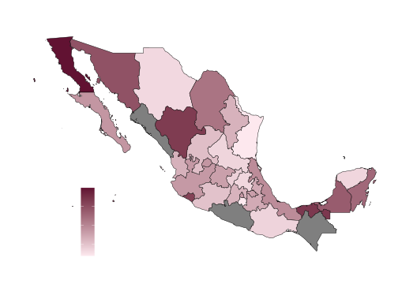
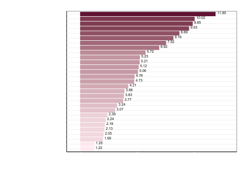
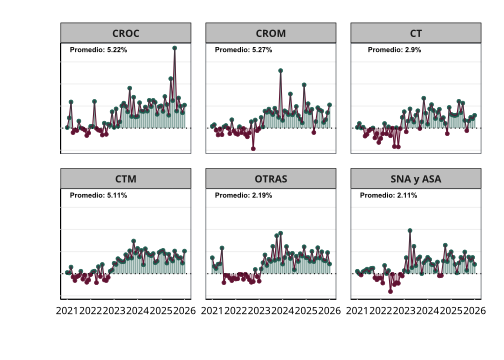

# Revisiones salariales y conflictos colectivos

*Disclaimer: Este repositorio sirve para automatizar el reporte sobre
revisiones salariales y negociaciones colectivas presentado en el
informe mensual del comportamiento de la economía de la Comisión
Nacional de los Salarios Mínimos*

## Jurisdicción Federal

              used (Mb) gc trigger (Mb) max used (Mb)
    Ncells  602130 32.2    1369535 73.2   701671 37.5
    Vcells 1107075  8.5    8388608 64.0  1928166 14.8

En lo que vamos de 2026 se han realizado 1487 revisiones salariales en
la jurisdicción federal, que involucraron a 873,228 personas
trabajadoras, quienes lograron incrementos promedio de 7.06% y de 2.79%
nominal y real, respectivamente.

Durante el mes de mayo de 2026, se registraron 214 revisiones en la
jurisdicción federal, que involucraron a 74,892 personas trabajadoras.

Estas revisiones tuvieron un incremento promedio nominal de 7.72% y real
de 3.64%.

## Jurisdicción local

En 2026, y hasta el mes de enero, fecha de los últimos datos
disponibles, se han realizado 282 revisiones en la jurisdicción local,
que involucraron a 101,465 personas trabajadoras, quienes lograron
incrementos promedio de 7.88% y de 3.94% nominal y real,
respectivamente.

Durante el mes de enero de 2026, última cifra disponible, se realizarón
282 revisiones en la jurisdicción local, que involucraron a 101,465
personas trabajadoras.

Estas revisiones tuvieron un incremento promedio nominal de 7.88% y real
de 3.94%.

## Revisiones por tipo de empresa

Durante mayo de 2026, de las 214 en la jurisdicción federal, 212 son de
empresas privadas y 2 en publicas. Esto involucró a 74,425 y 467
personas trabajadoras, respectivamente. En promedio, las empresas
privadas tuvieron incrementos nóminales de 7.75% y reales de 3.66%. Por
su parte, las empresas públicas tuvieron de 3.87% y -0.06%.

## Revisiones por entidad

Las cinco entidades con los mayores incrementos fueron: Michoacán
(9.07%), Sonora (7.39%), Guerrero (7.01%), Chiapas (6.82%) y Puebla
(5.95%).

En cambio, las cinco entidades con los menores incrementos fueron:
Querétaro (0.49%), Chihuahua (1.02%), Durango (1.46%), Ciudad de México
(1.68%) y Quintana Roo (1.73%).

## Revisiones por Central obrera

Las centrales obreras tuvieron variaciones de: CT (4.4%), CTM (3.4%),
OTRAS (3.3%), CROM (3.1%), SNA y ASA (3%) y CROC (2.4%).

## Emplazamientos a huelga por entidad
